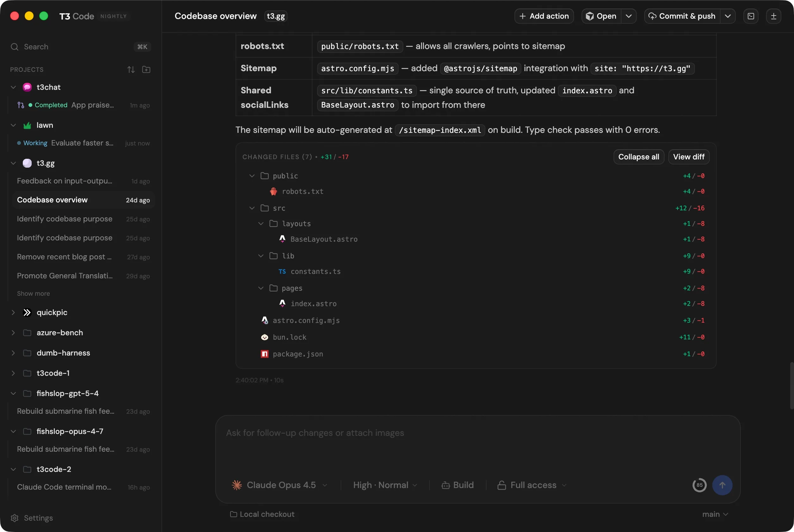
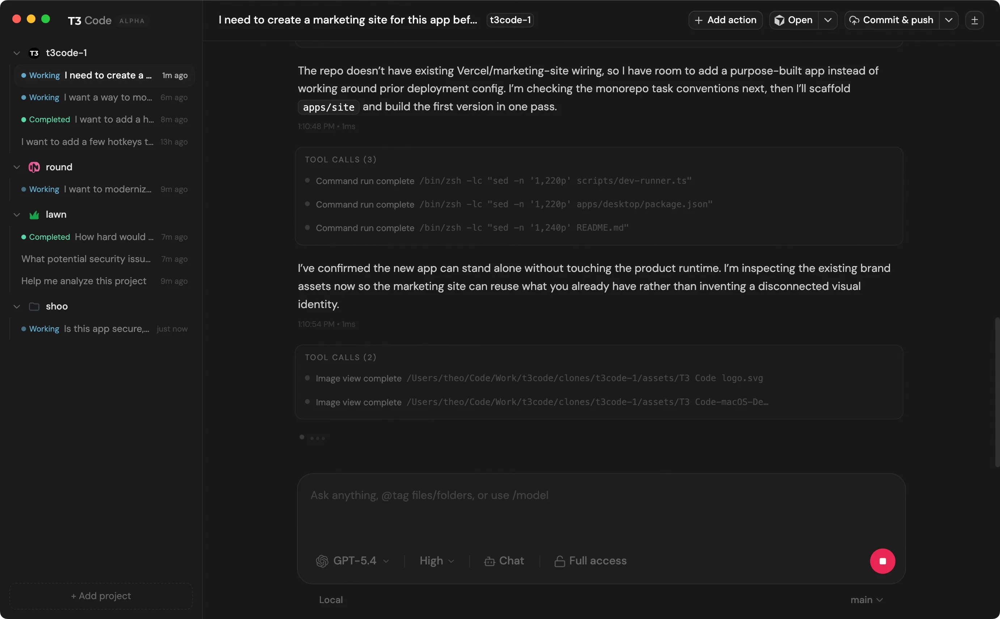

# VibeSwarm

VibeSwarm lets a small team share one private [T3 Code](https://t3.codes)
website.

Instead of giving every person their own server, VPN, pairing link, or weird
URL, you give everyone the same address:

```text
https://t3code.example.com
```

They sign in with Cloudflare Access, then their own isolated T3 Code workspace
opens in the browser. Each person gets their own container with an editor,
terminal, home directory, and coding agents. They cannot see or touch anyone
else's workspace.

## What This Is For

Use VibeSwarm when you want to host T3 Code for more than one trusted user:

- a small engineering team
- friends hacking on the same server
- a lab, class, or workshop
- your own fleet of browser-based dev environments

The normal T3 Code web mode is great for one person. VibeSwarm is the wrapper
that makes it practical for a group.

## Screenshots

This is the T3 Code UI your users get after VibeSwarm routes them into their
own browser workspace.





Screenshots are copied from the official
[pingdotgg/t3code](https://github.com/pingdotgg/t3code) repository.

## The Short Version

VibeSwarm does four jobs:

1. Keeps one public URL behind Cloudflare Access.
2. Looks at the signed-in user's email address.
3. Sends that user to their own Docker container.
4. Silently unlocks T3 Code for that container, so the user does not need to
   paste a pairing token.

Unknown users get a `403`. Known users get their own workspace.

```text
user opens t3code.example.com
  -> Cloudflare Access login
  -> VibeSwarm proxy checks the user's email
  -> user is routed to their own container
  -> T3 Code opens in the browser
```

## How It Works

VibeSwarm runs one T3 Code container per user. Cloudflare Access is the public
login screen and the only internet-facing entry point.

Behind Cloudflare, VibeSwarm uses an angie proxy to route each request by the
`Cf-Access-Authenticated-User-Email` header. That header is set by Cloudflare
Access after login.

```text
t3code.example.com
  -> Cloudflare Access
  -> Cloudflare Tunnel
  -> angie proxy
  -> vswarm-alex:3773
  -> t3 serve --mode web
```

T3 Code normally protects remote web access with a one-time pairing token.
VibeSwarm handles that token for each tenant and injects it behind the proxy.
From the user's point of view, there is only one login: Cloudflare Access.

## Quick Start

Requirements:

- Go 1.22+
- Docker
- a Cloudflare account with Zero Trust / Access
- a Cloudflare Tunnel token

Build the CLI and create the starter config:

```bash
make build
./vswarm init
```

Edit:

- `tenants.yaml` for your domain and users
- `.env` for `VSWARM_TUNNEL_TOKEN`

Then start everything:

```bash
./vswarm build
./vswarm up
./vswarm doctor
```

Add or remove users later:

```bash
./vswarm tenant add alex@example.com alex
./vswarm tenant rm alex --purge
./vswarm tenant ls
```

## Cloudflare Setup

You need two Cloudflare pieces.

First, create a Cloudflare Tunnel. Put its token in `.env`:

```env
VSWARM_TUNNEL_TOKEN=...
```

In the Zero Trust dashboard, point your public hostname at:

```text
http://vswarm-proxy:8080
```

Second, create a Cloudflare Access application for the same hostname. Use GitHub
OAuth or another identity provider, then allow only the emails listed in
`tenants.yaml`.

Cloudflare Access must pass the user's email through
`Cf-Access-Authenticated-User-Email`. VibeSwarm uses that email to choose the
right container.

## Managing Users

Users live in `tenants.yaml`:

```yaml
domain: t3code.example.com

tenants:
  - email: sarah@example.com
    name: sarah
  - email: alex@example.com
    name: alex
```

`email` must match the identity Cloudflare Access sends.

`name` becomes part of Docker names like `vswarm-alex`, so keep it lowercase and
DNS-safe.

After changing users, run:

```bash
./vswarm up
```

## Commands

| command | does |
| --- | --- |
| `vswarm init` | creates `tenants.yaml`, `.env`, and `config/` |
| `vswarm render` | turns `tenants.yaml` into generated Docker and proxy files |
| `vswarm build` | builds the workspace image |
| `vswarm up` | starts the stack and provisions tenants |
| `vswarm down` | stops the stack |
| `vswarm tenant add/rm/ls` | manages users |
| `vswarm pair <name>` | creates a new T3 token for one user |
| `vswarm status` | shows what is running |
| `vswarm logs` | shows stack logs |
| `vswarm doctor` | checks routing and isolation assumptions |

## Customizing Workspaces

The workspace image includes:

- T3 Code
- Claude Code
- OpenAI Codex
- GitHub CLI (`gh`)
- common dev tools such as `git`, `ripgrep`, `vim`, and build tools

Each user runs `gh auth login` once inside their workspace. Their credentials
persist in their own home volume.

To add more global tools, edit `templates/Dockerfile.tmpl`, then rebuild:

```bash
./vswarm build
./vswarm up
```

## Claude Code Memory

Claude Code stores project memory by absolute path. If you copy memory from a
laptop into a container with a different home path, Claude may not find it.

Use the import script to remap paths:

```bash
# From the machine that has the memory, into a running workspace:
scripts/import-claude-memory.sh --container vswarm-<user> --match '*/myorg/*'

# Or seed a tenant's home volume on the host before `vswarm up`:
scripts/import-claude-memory.sh --dest config/<user>/home --match '*/myorg/*'
```

The script copies distilled `memory/` by default, not raw session transcripts.
Use `--dry-run` to preview changes.

Memory can contain infrastructure details or secrets. Treat importing it into an
agent container as a security decision.

## Security

VibeSwarm is meant for trusted tenants by default. The workspace containers are
comfortable dev boxes: writable root filesystem, passwordless `sudo`, and common
tools installed.

That is convenient, but it is not a hostile-multi-tenant security boundary.
Read [THREAT-MODEL.md](THREAT-MODEL.md) before exposing this to real users.

To report a vulnerability, see [SECURITY.md](SECURITY.md).

## Deployment

This repo contains the app pieces: CLI, image, proxy templates, and tunnel
templates.

It does not provision your host or create your Cloudflare Access policy. See
[DEPLOYMENT.md](DEPLOYMENT.md) for the operator contract.

## License

[MIT](LICENSE)
