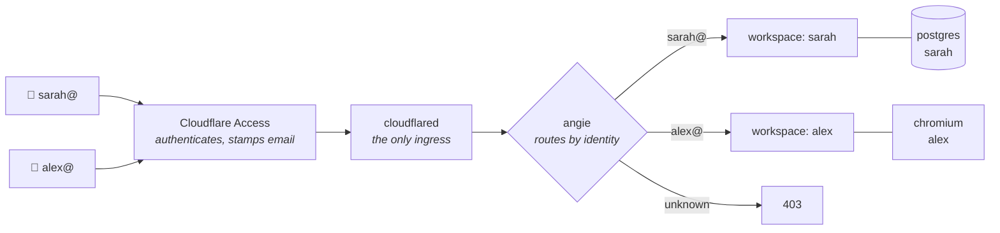
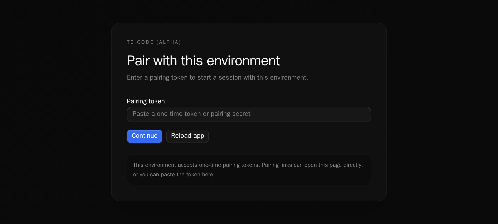
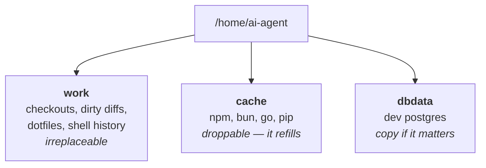

# VibeSwarm

**One browser-reachable dev box per person, on one host, isolated from each other.**

[](https://github.com/Dislace/vswarm/actions/workflows/ci.yml)
[](https://github.com/Dislace/vswarm/releases)
[](LICENSE)

A team runs coding agents. Agents want a real machine — install packages, run a
database, leave a long build going, keep a checkout dirty for three days — and
they want it from a phone, a laptop, a tab. Giving everyone a cloud VM is
expensive and unmanaged; sharing one box means everyone's agent shares one
filesystem.

VibeSwarm is the middle: one host, one container per person, reached over a
single authenticated URL. You describe the roster in a YAML file and run one
command.

```yaml
# tenants.yaml
domain: t3code.example.com
image: ghcr.io/dislace/vswarm-workspace:v0.1.0

tenants:
  - email: sarah@example.com
    name: sarah
    services: [postgres]
    admin: true
    repos: [Acme/api, Acme/web]
  - email: alex@example.com
    name: alex
    services: [playwright]
```

```console
$ vswarm up
up: stack running, all tenants provisioned
$ vswarm doctor
[PASS] rendered compose present
[PASS] angie -t config valid
[PASS] proxy answers CORS preflight without identity
[PASS] no published host ports
[PASS] isolation: sarah cannot reach proxy
[PASS] isolation: alex cannot reach sarah db
```

Sarah opens `https://t3code.example.com`, logs in with the team's identity
provider, and lands in her own workspace. Alex opens the same URL and lands in
his.

## How one URL becomes many workspaces

The proxy routes on **identity**, not on a path or a port. Cloudflare Access
authenticates at the edge and stamps the request with the user's email; angie
maps that email to a container and injects that tenant's session token.


```mermaid
flowchart LR
    S["👩 sarah@"] --> A
    X["🧑 alex@"] --> A
    A["Cloudflare Access<br/><i>authenticates, stamps email</i>"] --> T["cloudflared<br/><i>the only ingress</i>"]
    T --> P{"angie<br/><i>routes by identity</i>"}
    P -->|"sarah@"| WS["workspace: sarah"]
    P -->|"alex@"| WA["workspace: alex"]
    P -->|unknown| F["403"]
    WS --- DS[("postgres<br/>sarah")]
    WA --- PL["chromium<br/>alex"]
```

A workspace locks itself the moment it is network-reachable — reach one directly
and this is as far as you get:

<p align="center">
  
</p>

Tenants never see that screen. `vswarm pair` reconciles each tenant to exactly
one live session and hands the token to angie, which injects it after the
identity check — so the lock stays on for everyone else and opens for the person
Access just authenticated.

No host ports are published. The tunnel is the only way in, each workspace sits
on its own Docker network, and angie binds its listener where no tenant can
reach it — so a tenant who roots their own container still cannot touch anyone
else's. Full boundary list and its assumptions: **[THREAT-MODEL.md](THREAT-MODEL.md)**.

## What a workspace is

A normal Debian dev box with `sudo`, a writable root filesystem, and t3 — the
server the workspace *is* — serving the browser UI. Plus git, gh, node, python,
uv, a build toolchain, and a Chromium the preview tools drive so agents can see
the page they just changed.

Agent CLIs are yours to install, the provider's own way:

```bash
npm i -g @anthropic-ai/claude-code @openai/codex
```

They land in `~/.local`, ahead of `/usr/local/bin` on PATH, on the tenant's own
volume — so they survive container recreates and image bumps. Nothing in vswarm
reconciles or version-checks them.

## Why your uncommitted work survives

Tenant state is split by **how hard it is to rebuild**, one volume per class.
The thing you must protect is small; the thing that is large does not need
protecting.


```mermaid
flowchart TD
    H["/home/ai-agent"]
    H --> W["<b>work</b><br/>checkouts, dirty diffs,<br/>dotfiles, shell history<br/><i>irreplaceable</i>"]
    H --> C["<b>cache</b><br/>npm, bun, go, pip<br/><i>droppable — it refills</i>"]
    H --> D["<b>dbdata</b><br/>dev postgres<br/><i>copy if it matters</i>"]
```

One `XDG_CACHE_HOME`-style redirect per toolchain moves most of a home onto the
droppable volume, so migrating a tenant to another host copies megabytes, not
gigabytes. Declaring `repos:` makes the rest *rebuildable*: `vswarm-repos sync`
clones what is missing inside the workspace, using the tenant's own credentials,
and never touches a checkout that already exists.

## Operating it

`vswarm` is built to be driven by CI or Ansible: every command is idempotent,
flag- and env-driven, and exits non-zero on failure.

| Command | Does |
| --- | --- |
| `vswarm init` | scaffold `tenants.yaml`, `.env`, `config/` |
| `vswarm up` | render, start, provision and pair everything (`--json`) |
| `vswarm doctor` | verify every isolation invariant — use it as the deploy gate (`--wait=60s`) |
| `vswarm tenant add/rm/ls` | change one tenant without touching the others |
| `vswarm provision <name>` | make a work volume match a staging tree of credentials |
| `vswarm pair <name>` | reconcile a tenant to exactly one live t3 session |
| `vswarm status` / `logs` | compose state (`--json`) and log tails |

Host provisioning, secret material, and the Access policy live **outside** this
repo. This repo ships the image, the CLI, and the templates.

> **One setting decides whether it works at all:** the access layer must let
> `OPTIONS` reach the origin. A CORS preflight carries no identity to route on,
> and an Access layer that rejects it locks out every browser-based client with
> an error that has no HTTP status in it. See
> [CORS preflights](DEPLOYMENT.md#cors-preflights).

## Where to go next

| You want to | Read |
| --- | --- |
| Deploy it, or wire it into Ansible/CI | **[DEPLOYMENT.md](DEPLOYMENT.md)** — the operator contract |
| Know what a hostile tenant can reach | **[THREAT-MODEL.md](THREAT-MODEL.md)** |
| See every config key | **[tenants.example.yaml](tenants.example.yaml)** |
| Contribute | **[CONTRIBUTING.md](CONTRIBUTING.md)** · [CODE_OF_CONDUCT.md](CODE_OF_CONDUCT.md) |
| Report a vulnerability | **[SECURITY.md](SECURITY.md)** |

VibeSwarm assumes tenants are **trusted people running untrusted code**. The
workspace is deliberately a normal dev box; the boundaries that stay hard are
the ones *between* users. If your tenants are hostile to each other, read the
hardening section of the threat model before you deploy.
